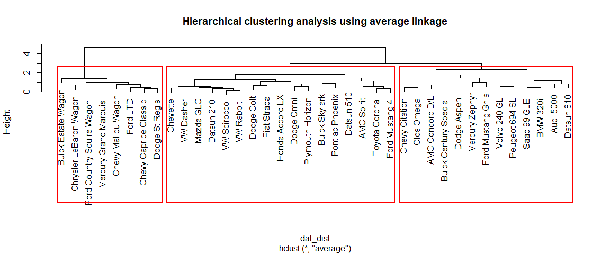
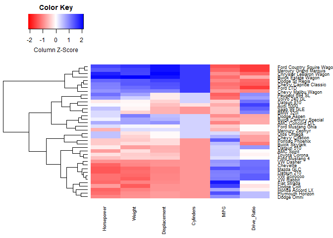
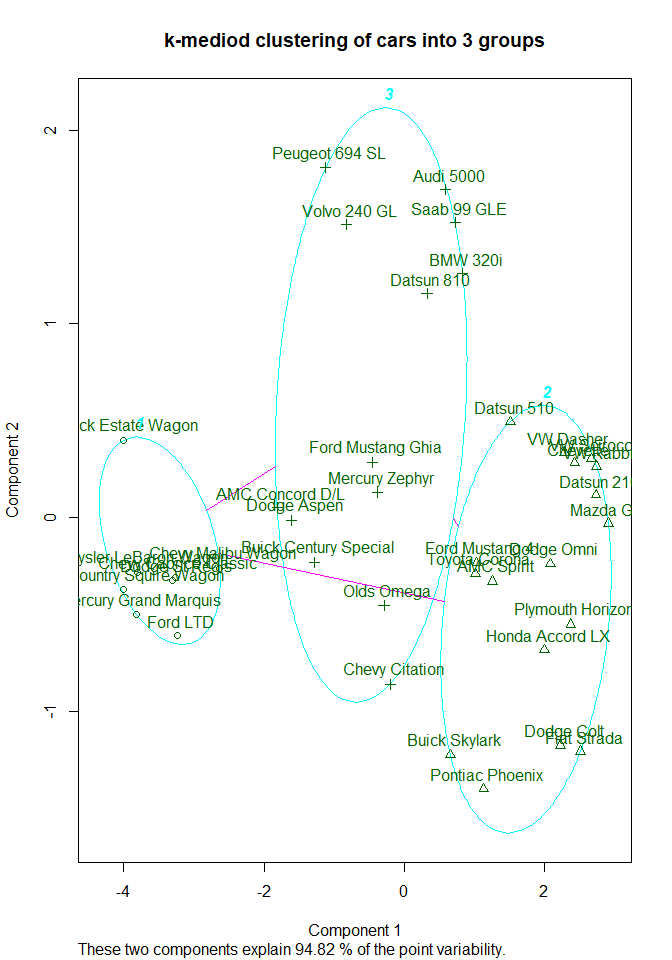
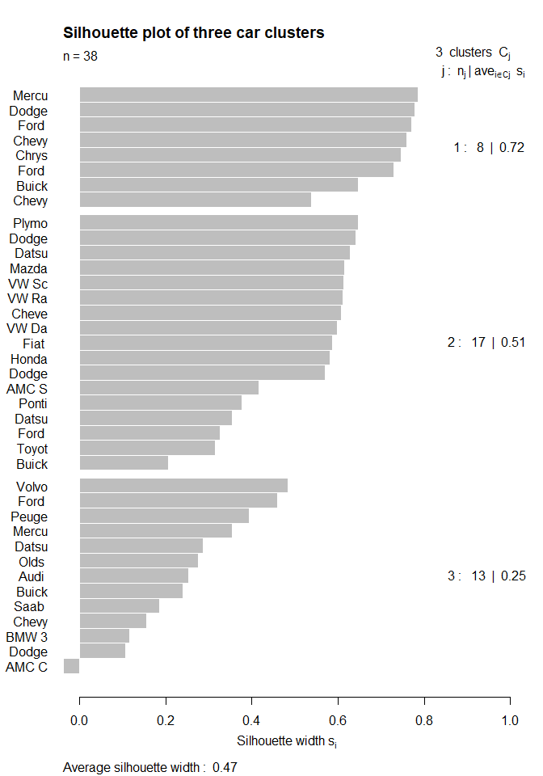

SI 618 Fall 2017, Homework 10
================
Taylor Spooner

#### Part 1. \[20 points\] Data preparation

To prepare for clustering, you need to scale the data: Do this for the **cars** dataset by calling the appropriate R scaling function: use settings so that each variable (column) is centered by subtracting the variable (column) mean, and scaled by dividing by the variable's standard deviation. Use the car names for the data frame row names.

1.  Show the first 5 rows of the scaled data frame, and

<!-- -->

    ##                                  MPG    Weight Drive_Ratio Horsepower
    ## Buick Estate Wagon        -1.2005727  2.117935  -0.7020495  2.0141161
    ## Ford Country Squire Wagon -1.4144009  1.685040  -1.6099861  1.5225285
    ## Chevy Malibu Wagon        -0.8492836  1.049846  -1.0304521  0.8796831
    ## Chrysler LeBaron Wagon    -0.9561977  1.523766  -1.2429479  1.8250439
    ## Chevette                   0.8002478 -1.001449   1.1717771 -1.2757395
    ##                           Displacement  Cylinders
    ## Buick Estate Wagon           1.9432589  1.6252130
    ## Ford Country Squire Wagon    1.9545104  1.6252130
    ## Chevy Malibu Wagon           1.0093813  1.6252130
    ## Chrysler LeBaron Wagon       2.0557742  1.6252130
    ## Chevette                    -0.8921284 -0.8700635

1.  Compute a distance object based on the Euclidean distance between the rows of the scaled dataset. Convert the distance object to a matrix and show the 5x5 upper corner of the matrix (i.e. containing the first 5 rows and columns).

<!-- -->

    ##                           Buick Estate Wagon Ford Country Squire Wagon
    ## Buick Estate Wagon                 0.0000000                 1.1398481
    ## Ford Country Squire Wagon          1.1398481                 0.0000000
    ## Chevy Malibu Wagon                 1.8791302                 1.5379233
    ## Chrysler LeBaron Wagon             0.8681787                 0.6873475
    ## Chevette                           6.5064614                 6.4822961
    ##                           Chevy Malibu Wagon Chrysler LeBaron Wagon
    ## Buick Estate Wagon                  1.879130              0.8681787
    ## Ford Country Squire Wagon           1.537923              0.6873475
    ## Chevy Malibu Wagon                  0.000000              1.5065957
    ## Chrysler LeBaron Wagon              1.506596              0.0000000
    ## Chevette                            5.125092              6.3106342
    ##                           Chevette
    ## Buick Estate Wagon        6.506461
    ## Ford Country Squire Wagon 6.482296
    ## Chevy Malibu Wagon        5.125092
    ## Chrysler LeBaron Wagon    6.310634
    ## Chevette                  0.000000

#### Part 2. \[20 points\] Hierarchical clustering.

Using the distance object you computed from 1(b), compute and plot a hierarchical cluster analysis using average-linkage clustering. With this clustering, cut the tree into 3 clusters and plot the dendogram with red borders around the clusters (Hint: use rect.hclust() function).



#### Part 3. \[10 points\] Using clustering results

The output from the tree-cutting function in 2(b) above should produce a mapping of car type to cluster number (from 1 to 3), like this:

``` r
groups.3
```

    ##        Buick Estate Wagon Ford Country Squire Wagon 
    ##                         1                         1 
    ##        Chevy Malibu Wagon    Chrysler LeBaron Wagon 
    ##                         1                         1 
    ##                  Chevette             Toyota Corona 
    ##                         2                         2 
    ##                Datsun 510                Dodge Omni 
    ##                         2                         2 
    ##                 Audi 5000              Volvo 240 GL 
    ##                         3                         3 
    ##               Saab 99 GLE            Peugeot 694 SL 
    ##                         3                         3 
    ##     Buick Century Special            Mercury Zephyr 
    ##                         3                         3 
    ##               Dodge Aspen           AMC Concord D/L 
    ##                         3                         3 
    ##     Chevy Caprice Classic                  Ford LTD 
    ##                         1                         1 
    ##     Mercury Grand Marquis            Dodge St Regis 
    ##                         1                         1 
    ##            Ford Mustang 4         Ford Mustang Ghia 
    ##                         2                         3 
    ##                 Mazda GLC                Dodge Colt 
    ##                         2                         2 
    ##                AMC Spirit               VW Scirocco 
    ##                         2                         2 
    ##           Honda Accord LX             Buick Skylark 
    ##                         2                         2 
    ##            Chevy Citation                Olds Omega 
    ##                         3                         3 
    ##           Pontiac Phoenix          Plymouth Horizon 
    ##                         2                         2 
    ##                Datsun 210               Fiat Strada 
    ##                         2                         2 
    ##                 VW Dasher                Datsun 810 
    ##                         2                         3 
    ##                  BMW 320i                 VW Rabbit 
    ##                         3                         2

With this group mapping, produce three tables:

1.  a 1-dimensional contingency table showing the number of cars in each cluster;

2.  a 2-dimensional contingency table of the number of cars in each cluster from each country of manufacture; and

3.  a table showing the median value per cluster of each variable.

The desired output is shown here:

    ## groups.3
    ##  1  2  3 
    ##  8 17 13

    ##    
    ##     France Germany Italy Japan Sweden U.S.
    ##   1      0       0     0     0      0    8
    ##   2      0       3     1     6      0    7
    ##   3      1       2     0     1      2    7

    ##   Group.1  MPG Weight Drive_Ratio Horsepower Displacement Cylinders
    ## 1       1 17.3   3.89        2.43      136.5          334         8
    ## 2       2 30.9   2.19        3.37       75.0           98         4
    ## 3       3 20.8   2.91        3.08      110.0          171         6

#### Part 4. Heatmaps \[10 points\]

Use the heatmap.2 function to produce a heatmap of the cars dataset with these settings:

-   average-link clustering

-   column-based scaling

-   row-based dendrogram

-   no density info

You do not need to reproduce the exact width and height shown here, but for reference the example used these settings:

margins = c(5, 8), cexRow=0.7,cexCol=0.7.



#### Part 5. \[20 points\] k-medoids clustering.

Apply the \`partitioned around medoids' R function to the distances you computed in 1(b) to find three clusters of cars.

1.  Compare this to the 3 clusters you found with heirarchical clustering in Part 2, by showing the 2-dimensional contingency table for the hierarchical group variable (shown in Part 3) vs. the clustering variable that is output by the 'partitioned around medoids' function (Part 4). How well do the two clusterings agree?

> Looking at the table below we see that the two clustering techniques match up perfectly with each other. The rows represent the clusters from the heirarchical clustering while the columns represent the clustering from pam.

    ##        PAM  1  2  3
    ## HClust             
    ## 1           8  0  0
    ## 2           0 17  0
    ## 3           0  0 13

1.  Give the medoid car found for each cluster.

> The mediod car for each cluster is:

    ## [1] "Medoid car for group 1 is: Dodge St Regis"
    ## [1] "Medoid car for group 2 is: Dodge Omni"
    ## [1] "Medoid car for group 3 is: Ford Mustang Ghia"

1.  Show the k-medoids clusters from 5(a) using the appropriate bivariate cluster plotting function, as shown.



#### Part 6. \[15 points\] Assessing cluster quality.

Create a silhouette plot based on the k-medoid clusters found in Part 5 and distance matrix from Part 1. What can you conclude from the plot about the quality of these three clusters?

> Below we plot the silhouette plot for the three car clusters. The silhouette width for the first two plots shows little variance within these clusters. The third cluster shows more variance within it and not as similiar of points within the cluster. We also notice that within cluster 3 there is the "AMC C" car that has a negative value. This shows less quality in the third cluster.


