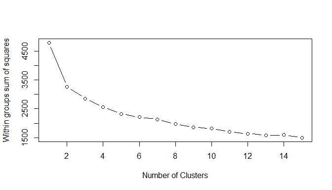
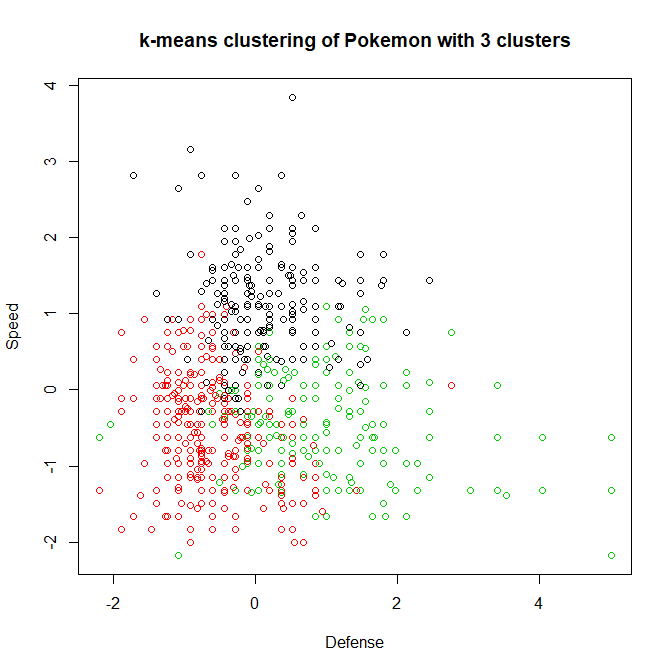
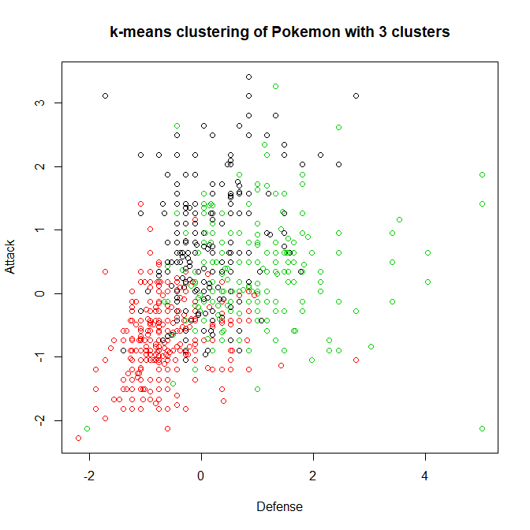
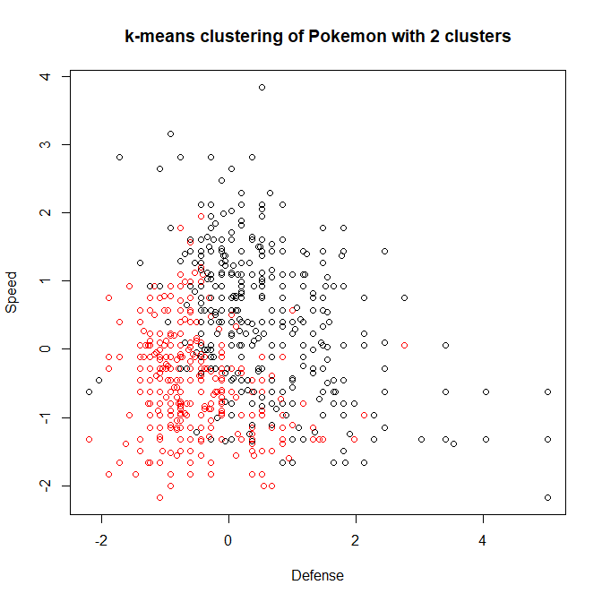
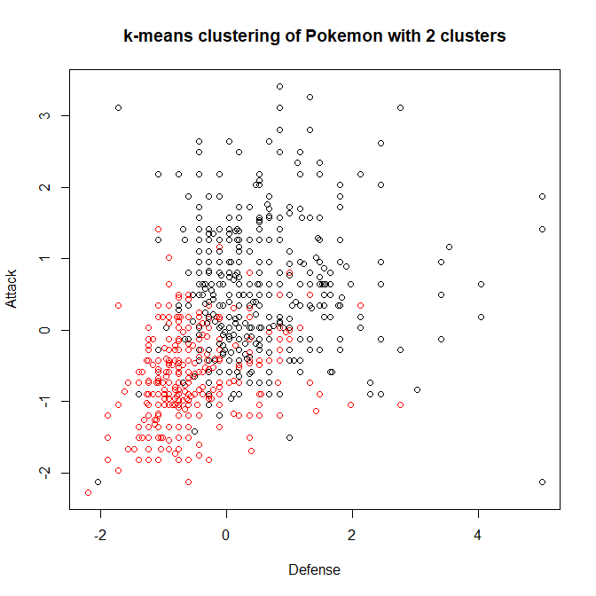

SI 618 Fall 2017 Lab 10
================
Taylor Spooner

Part 1. Data Preperation
------------------------

To prepare for clustering, you need to extract the relevant columns: HP, Attack, Defense, Sp..Atk, Sp..Def, and Speed. Next, scale the data: Do this by calling the appropriate R scaling function: use settings so that each variable (column) is centered by subtracting the variable (column) mean, and scaled by dividing by the variable's standard deviation.

Show the first 5 rows of the scaled data frame:

    ##            HP      Attack    Defense    Sp. Atk    Sp. Def      Speed
    ## 1: -0.9500319 -0.92432794 -0.7966553 -0.2389808 -0.2480334 -0.8010021
    ## 2: -0.3625953 -0.52380252 -0.3476999  0.2194223  0.2909743 -0.2848371
    ## 3:  0.4206536  0.09239043  0.2936649  0.8306264  1.0096513  0.4033830
    ## 4:  0.4206536  0.64696408  1.5763945  1.5029509  1.7283282  0.4033830
    ## 5: -1.1850065 -0.83189899 -0.9890647 -0.3917818 -0.7870411 -0.1127821

Part 2. Identify the right number of clusters
---------------------------------------------

The first challenge with the Pokemon data is that there is no pre-determined number of clusters. You will assess the appropriate number of clusters by inspecting how the within group sum of squares varies with respect to the number of clusters. Keep in mind that in real data the elbow in the scree plot might be less of a sharp elbow than in synthetic data. Use the simple plot() function to visualize the within group sum of squares for when k=1:15.

Part 3. Plot the clusters.
--------------------------

1.  Plot the outcomes of the clustering on two dimensions of the data when k (number of clusters)=3. Here, you should plot what cluster the data points with given Defense and Speed characteristics are assigned to (x-axis: Defense, y-axis: Speed, color:cluster assigned).

Next plot the relationship between Attack, Defense and the clusters assigned in a similar fashion. Your plot should look like this:

1.  Repeat the same analysis for k=2.

